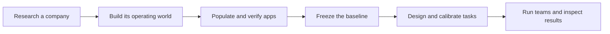

# AgentCompanyFactory

[](https://github.com/ljang0/agentcompanyfactory/actions/workflows/ci.yml)

A pipeline for generating synthetic multi-agent computer-use environments from
real companies.

AgentCompanyFactory researches a company's work, defines a manager and workers
with concrete responsibilities, and builds a shared operating world across
business apps. Each worker receives its own desktop VM, app access and role-specific
information. The tasks are designed to require communication, delegation and work
that depends on another person's contribution.

This repository implements environment generation and validation: dossiers, seeded
apps, worker environments, tasks, reference solutions, verifiers and recorded team
trials. Its outputs are inspectable company environments with evidence of what
worked, what failed and whether the initial state was restored.

**[Getting started](docs/GETTING-STARTED.md)** · **[Pipeline](docs/PIPELINE.md)** ·
**[Example](examples/sanmar/README.md)** · **[Use as a template](docs/TEMPLATE.md)** ·
**[Contributing](CONTRIBUTING.md)**

## Why company environments?

A company provides a connected source of roles, policies, customer history and
operational constraints. That context lets a task depend on more than access to
a particular app: a manager may need an account representative's customer context,
an operations worker's constraints and a specialist's implementation before a
business decision can be completed.

The project builds on environment-generation approaches such as
[CUA-Gym](https://cua-gym.xlang.ai/) and
[Gym-Anything](https://cmu-l3.github.io/gym-anything/), using a researched company
as the starting point for a shared multi-worker environment.

A generated company contains:

- **An operating world:** customers, policies, orders, conversations and files with
  consistent identities and history.
- **Worker environments:** individual roles, app access and desktop materials.
- **Tasks grounded in that world:** assignments and private assessments tied to
  specific records, permissions and responsibilities.
- **Evaluation machinery:** independent references, Python verifiers, semantic
  rubrics, calibration cases and team trials.
- **Inspectable evidence:** final app states, delivered files, actor history,
  screenshots, grades and reset receipts.

## How the pipeline works



The world comes before the tasks. Tasks are derived from unfinished work in an
accepted environment. Each stage saves a checkpoint; later stages verify its
inputs before reusing it. Workers see their assignments and permitted systems.
Assessments, references and graders remain outside their environment. Reference-guided
teacher trials check feasibility; ordinary trials use the same harness without
reference guidance. Both retain business scores, contribution checks and runtime
outcomes so difficulty is distinguishable from a broken environment.

The [pipeline guide](docs/PIPELINE.md) maps all eight stages to commands, artifacts
and acceptance checks. The [architecture guide](docs/ARCHITECTURE.md) maps them to code.

## Get started

Install [uv](https://docs.astral.sh/uv/) and Python 3.12+, then:

```sh
git clone https://github.com/ljang0/agentcompanyfactory.git
cd agentcompanyfactory
make setup
make doctor
```

This installs the locked dependencies, creates an ignored local configuration and
checks the included catalogs. It does not call a model or create a company.

Next, [inspect the included example](examples/sanmar/README.md),
[configure a new company run](docs/GETTING-STARTED.md), or
[create your own repository from this template](docs/TEMPLATE.md).
Native app execution requires the external CUA-Gym hub; desktop trials also require
a VM image and model access. The setup guide lists each execution mode's requirements.

## Example: apparel supply company

[Cedarline Apparel Supply](examples/sanmar/README.md), informed by SanMar research,
contains four workers, eight apps and two reviewed tasks: an account assortment
review and a qualified acquisition review.

Browse the assignments, reference actions and grades in GitHub. The
[inspection release](https://github.com/ljang0/agentcompanyfactory/releases/tag/sanmar-inspection-2026-09-14)
contains the complete world, delivered files, screenshots and replay proof.
Both references passed native replay and reset; full ordinary-team and ablation
acceptance remains open. [Measured results and limits](docs/END-TO-END-PLAN.md).

## Repository map

| Path | Purpose |
| --- | --- |
| `src/company_envs/` | Pipeline, app runtime, task evaluation and packaging |
| `configs/` | Starter configuration and the measured pilot configuration |
| `docs/` | Setup, pipeline, architecture and extension guides |
| `examples/` | Inspectable company tasks and measured outputs |
| `catalogs/` | App contracts, probes and occupational reference data |
| `.agents/skills/` | Authoring and independent review instructions |
| `tests/` | Regression tests and fixtures |
| `scripts/` | Development, app inspection and population tools |

`companies/cort/` and the small `experiments/` directories are retained regression
fixtures. New run outputs belong in ignored `workspace/` or `runs/` directories.
The Python package and CLI are named `company_envs` and `company-envs`.

## Development

Coding agents should start with [AGENTS.md](AGENTS.md) for setup, stage contracts,
checkpoint rules, testing and operational pitfalls.

```sh
make check
```

Tests make no live model calls. Linux, Node/npm, bubblewrap and Chromium enable the
runtime checks; external-hub checks run when that checkout is available. See
[development](docs/DEVELOPMENT.md) for focused checks and extension points.

Licensed under [Apache-2.0](LICENSE).
