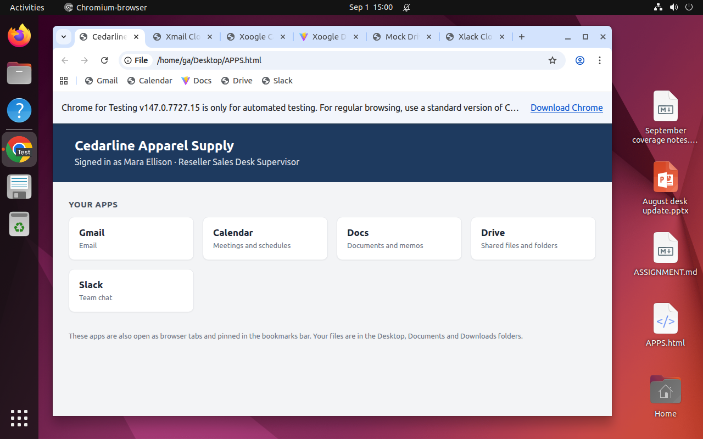
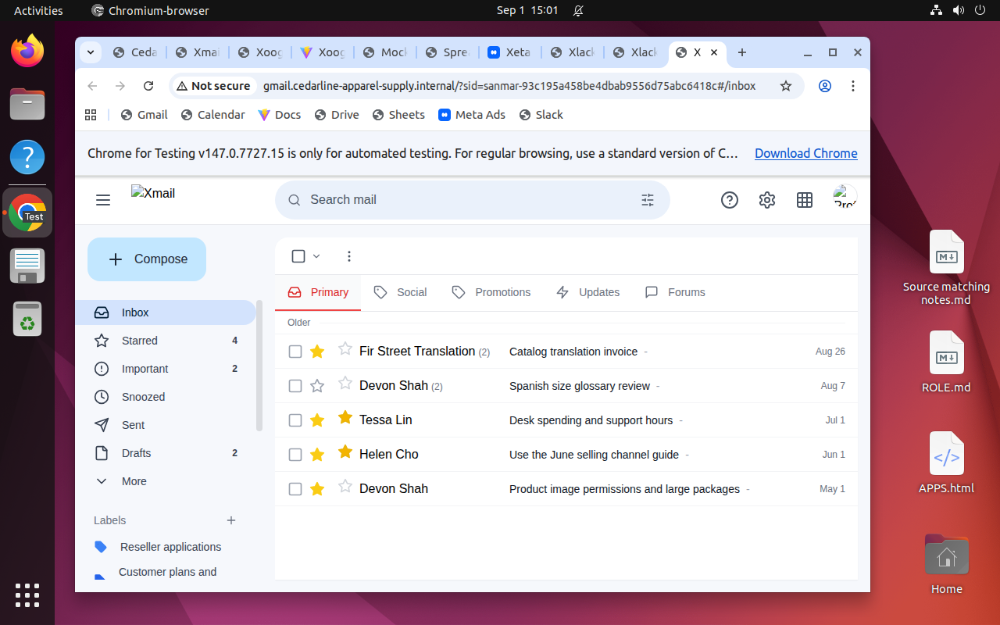
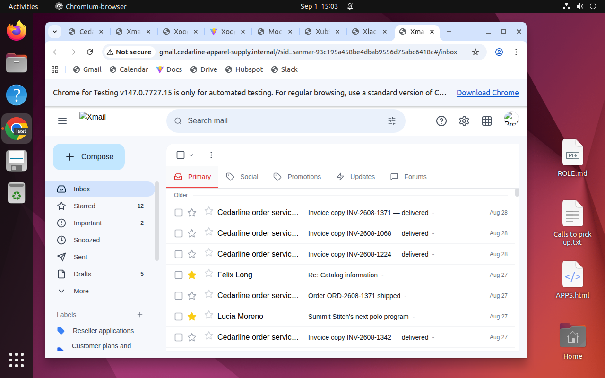

# A spending decision made by four workers

This is one recorded teacher trial from Cedarline Apparel Supply, the fictional
company informed by SanMar research. The manager and three specialists worked in
separate desktop VMs against eight shared apps. The teacher received private
reference guidance. The harness allowed both browser actions and Bash; this
episode used Bash to read and write native app state through worker proxies.
It is not evidence of a solution completed entirely through graphical controls.

## The assignment

On September 1, 2026, the sales supervisor had to choose September advertising
spending and sales support for three running campaigns. The
[assignment](../tasks/sanmar_qualified-acquisition-review/assignment.json) asks for
at least two practical choices, checked calculations, matching advertising
settings and named customer follow-ups, using records through August 31.

A cheap advertising result did not necessarily represent a new eligible reseller.
The team had to connect campaign spending to individual inquiries, application
documents and orders, while protecting existing customer work.

## What each worker had

| Worker | Starting information and access | Contribution in the recorded trial |
| --- | --- | --- |
| Mara Ellison, sales supervisor | Spending authority, support capacity, email, calendar, documents, drive and chat | Chose the spending/support plan, approved implementation and integrated the specialists' findings |
| Imani Brooks, account representative | HubSpot applications and customer history, application documents and follow-up notes | Distinguished nine inquiries from eight identities and preserved each unresolved application's requirements |
| Owen Delgado, order coordinator | Commercial ledger, historical order exports and service constraints | Separated invoiced purchases, credits, unallocated commitments and unposted claims; checked support capacity |
| Priya Nair, marketing specialist | Advertising controls, delivery totals and source-matching notes | Compared campaign economics, costed support choices and implemented approved settings |

Each specialist also had the common communication and document apps. The manager's
desktop started with its own materials and assignment:

The same email application showed different records to different workers.
Priya's inbox contained marketing work and shared spending guidance:

Imani's inbox contained customer correspondence and order notices:

These are unedited screenshots from the published trial. They show the desktop
and app views at those moments; the full trace records actions and resulting state.

## What the team produced

The supervisor's [saved decision record](decision.json) chose decorator-only
advertising with bounded sales support. The [saved options worksheet](support-options.json)
contains the team's calculations. These are extracted records from the final native
state, with values preserved.

| September plan | Keep all three campaigns | Keep decorator campaign only, selected |
| --- | ---: | ---: |
| Planned media spending | $4,050 | $1,950 |
| Additional weekly representative hours | 12 | 6 |
| Additional weekly order-services hours | 6 | 3 |
| Additional weekly marketing hours | 8 | 4 |
| Estimated weekly internal support cost | $1,228 | $614 |

Both choices fit the $6,000 monthly media authority. The selected plan retained
the decorator campaign at $65 per day and paused the other two campaigns and
their corresponding ad sets and ads. The $1,950 figure is a 30-day planning
estimate, not a native monthly spending cap.

The decision explains why a lower cost per platform result was insufficient:
inquiries included a repeated applicant, an existing customer and an end-user
school. The only observed invoiced purchase among the reviewed new relationships
was Riverbend's $2,520 order. That concentration limited what the team could claim
about future acquisition performance.

The team also saved seven named HubSpot follow-ups covering six unresolved
applications and one existing customer. It kept missing paperwork and central
approval requirements open. Paused advertising did not cancel those obligations.

## How it was assessed

The retained [grade](../trials/sanmar_qualified-acquisition-review/teacher-grade.json)
records a business score of **1.0**, all four business criteria passing, and all
four worker contribution/consumption checks passing. Those checks examine whether
another worker actually used each contribution in surviving work, alongside
trusted actor records. The [trial receipt](../trials/sanmar_qualified-acquisition-review/teacher.json)
records the execution and reset result.

The separate clean-extraction check replayed both tasks' reference solutions
through native worker proxies, ran isolated Python mechanics, and restored the
initial state. That replay used no models.

Ordinary-team success and worker/input ablations remain unestablished. This
reference-guided teacher result therefore demonstrates one feasible execution
under the recorded harness, with the limits listed in the
[measured status](../../../docs/END-TO-END-PLAN.md).

## Follow the evidence

[PROVENANCE.json](PROVENANCE.json) records each screenshot's archive path and
SHA-256, and each output record's source file and JSON pointer. The
[full inspection release](https://github.com/ljang0/agentcompanyfactory/releases/tag/sanmar-inspection-2026-09-14)
contains the world, all retained grades, native final states and complete latest
trial traces. Its `INSPECT.md` links those files. Follow the
[replay instructions](../../../docs/COLLABORATOR.md) to check the archived source
and data without reseeding.
