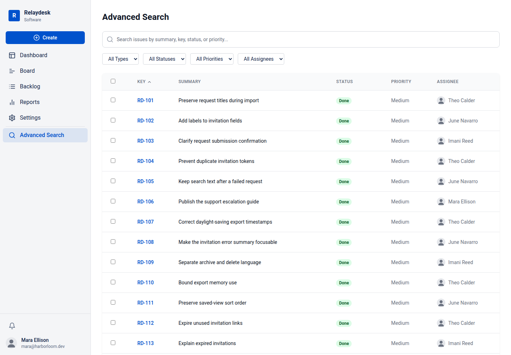
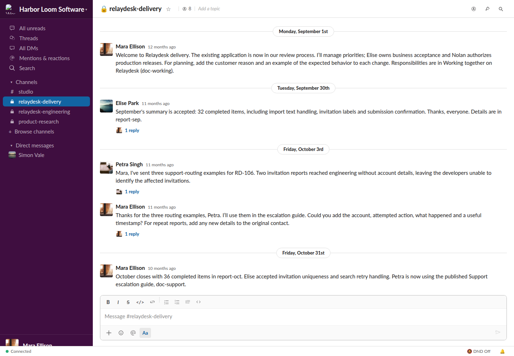

# Software delivery company

Harbor Loom Software is a fictional delivery studio informed by accepted thoughtbot
research. Its four-person team maintains Relaydesk, a request-management application
for the client Brindle Works. The world includes a year of delivery history, customer
observations, code review records, research notes and unfinished product decisions.

This example covers world construction and acceptance, through Stage 4. Task design,
reference solutions, grading and team trials have not been run for this company.

## People and information

| Worker | Responsibility | Local material |
| --- | --- | --- |
| Mara Ellison, product delivery lead | Scope, capacity and client commitments | Delivery agreement, capacity workbook, commercial correspondence and coverage notes |
| Imani Reed, product designer | Research interpretation and interaction requirements | Participant notes, observation workbook, consent guidance and review notes |
| Theo Calder, backend developer | Data contracts, recovery and server review | Source extract, imported-request sample, restoration notebook and regression report |
| June Navarro, frontend developer | Browser behavior and interface review | Source extract, browser observations, support correspondence and design review |

All four workers use GitHub, Jira, Gmail, Slack, Calendar, Docs and Drive. Mail,
private conversations and document permissions scope records to their recipients.
Each worker also has six local files. For example, Imani holds participant-level
research notes while the team receives an approved summary.

Client business acceptance and production release authority belong to named client
counterparts. The delivery team can make recommendations and record reviews.
Existing source snapshots and test reports are documentary inputs to that work.

## What the run exercised

The run reused accepted research and used `seed-core`, `populate-world`,
`patch-population`, `recheck-population`, `review-world`, `verify-world` and
`freeze-world`. The immutable core contains 224 entities and 65 history records,
with 24 worker files and 17 native population targets. Its reference date is
September 1, 2026.

Native population continued from saved app records when checked templates could
not supply the missing content. The shared command authored bounded literal batches.
Review then required explicit repairs: Slack thread links, conversations across four
apps, report chronology, GitHub issue fields and three missing branch artifacts.
The accepted core was retained; one document correction, one issue-date correction
and three artifact additions are recorded separately. The effective world contains
227 entities.

The final repair removed 108 redundant Slack posts and replies while retaining all
130 thread roots and the original population targets. The full archive keeps each
failed review, original affected state, authored repair proposal and exact field
patch. This is a measured second use of the staged pipeline.
It still required operator-directed content repair; it does not establish unattended
generation for arbitrary companies.

## Native contents

| App | Saved records |
| --- | --- |
| Gmail | 720 emails and 5 drafts |
| Slack | 1,747 messages, 130 threads and 4 private conversations |
| Calendar | 64 events |
| Jira | 112 issues and 160 comments |
| GitHub | 112 issues, 3 pull requests, 7 files, 16 discussions and 12 releases |
| Docs | 26 documents and 45 comment threads |
| Drive | 38 items, including the shared document copies |

GitHub and Jira project the same issue work. Docs and Drive share document contents;
these counts are native records rather than independent business facts.

## Inspect the result

All three reviewers voted to accept the world. All seven native runtime gates
passed across 28 worker/app views,
including seven browser writes and exact reset. A clean extraction repeated those
checks using the archived source with zero model calls. See the
[verification receipt](reports/VERIFIED.json) for its scope and archive hash.

These are browser captures from native world acceptance. The checker opens every
worker/app pair, performs one write per app, verifies the resulting shared state
and resets it. It also checks a shared Docs/Drive edit and reads the delivery
workbook. These captures are not desktop-team trajectories.

Read the [company roles](company.json), [content review](reports/REVIEW.json),
[runtime checks](reports/RUNTIME.json) and [frozen baseline](reports/FROZEN.json).
[PROVENANCE.json](PROVENANCE.json) maps this small selection to the complete archive.
This directory is an inspection example, not a runnable checkpoint.

The accepted review retains seven warnings: early references to RD-106 in three
apps, inconsistent wording about Westhaven timestamps in two issue views, a
serializer/contract mismatch, and legacy browser observations that do not establish
current browser coverage. The full findings remain in `reports/REVIEW.json`.

Download the full [world snapshot](https://github.com/ljang0/agentcompanyfactory/releases/tag/thoughtbot-world-2026-09-14)
for the native states, worker files, research, repair history and exact pipeline
source. Its `WORLD-README.md` gives hash verification and native replay commands.
The separate `thoughtbot-world-20260914-VERIFIED.json` identifies the tested archive
by SHA256. No task authoring, grading, VM team trial or ablation was run for this
company; [SanMar](../sanmar/README.md) provides the task-level example.
