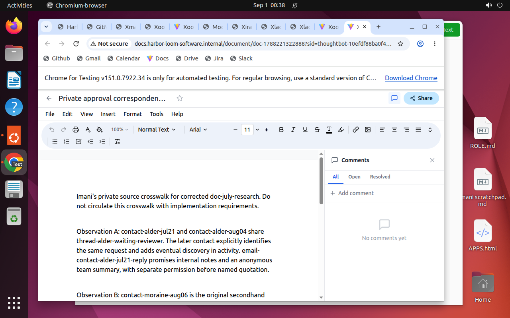
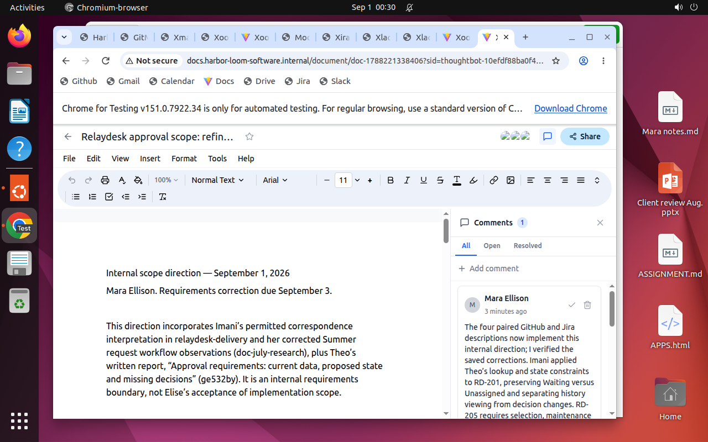

# Turning customer reports into a bounded product decision

This is the successful product-scope teacher from Harbor Loom Software, the
fictional company informed by thoughtbot research. Mara, Imani and Theo worked in
separate desktop VMs against the same operating world. The teacher received
reference guidance. The harness allowed browser actions and Bash, including DOM
interaction and reads through each worker's native app proxies. This episode does
not establish a solution completed entirely through graphical controls.

## The assignment

The [brief](../tasks/thoughtbot_o-product-scope/assignment.json) asks the team to
clarify four approval requirements in Relaydesk, correct their GitHub and Jira
records, recommend a small next step and draft a client update by September 3, 2026.

The starting backlog mixed observed difficulty with requested features and
unanswered questions. A report about finding an old approval did not establish
that someone needed to reopen a declined request. Repeated correspondence about
one request did not establish two independent observations. A requested state
field was still a draft proposal, not deployed behavior.

## Information and collaboration

All three workers had GitHub, Jira, Gmail, Slack, Calendar, Docs and Drive. Their
identities, private records and local materials differed.

| Worker | Relevant information | Surviving contribution |
| --- | --- | --- |
| Mara Ellison, product delivery lead | Client authority, commitments, capacity, leave and reporting limits | A scope decision combining the research and technical findings, followed by a client draft |
| Imani Reed, product designer | Participant-level correspondence, research permissions and observation notes | A corrected anonymous research summary and visibility/routing requirements that used the technical findings and scope decision |
| Theo Calder, backend developer | Serializer and contract extracts, imported-request examples and recovery notes | A comparison of current and proposed behavior, followed by contract requirements that used the research and scope decision |

Imani kept the source crosswalk private and shared a permitted interpretation.
This unedited capture shows the private document on her desktop:

The [saved research summary](research-summary.json) distinguishes one continuing
reviewer-discovery case, a separate secondhand account about approval history,
and a separate routing request. It retains unanswered questions and avoids
restricted identities or quotations.

Theo's comparison distinguished decision status from assignment. A nullable
reviewer identifier did not guarantee a display name or availability. The draft
pending state could collapse waiting and unassigned cases; its compatibility and
recovery behavior still needed investigation.

## The resulting decision

Mara's [saved scope document](scope-decision.json) recommends focused refinement
of finding existing review information from the request page. It incorporates
both specialists' findings and sets boundaries for their follow-up work.

| Requirement | Recorded disposition |
| --- | --- |
| RD-201, reviewer visibility | Refine access to existing review information; verify authorized lookup, missing-data behavior and complete interaction examples |
| RD-203, request states | Investigate compatibility and unresolved cases; require a dependency only where a concrete visibility example needs it |
| RD-205, department routing | Investigate selection rules, maintenance authority, fallback and manual override separately |
| RD-207, reopening declined requests | Keep reading history separate from changing a decision; establish allowed and denied actions before implementation scope |

All four GitHub/Jira pairs received consistent corrections. The
[saved RD-201 requirement](visibility-requirement.json) shows how Imani used
Theo's technical constraints and Mara's direction. Original ownership, priorities
and unfinished status were retained; PR #88 remained open and draft.

The [client draft](client-draft.json) explains the proposed direction, unresolved
investigations and conditions before estimates or customer dates can be trusted.
It was saved as a draft. Elise retained business acceptance authority.

## The measured result

The [grade](../trials/thoughtbot_o-product-scope/teacher-grade.json) records **1.0**,
all four business criteria passing and all three contribution/consumption checks
passing. Those checks require evidence that another worker used each contribution
in surviving work, supported by trusted actor history. The
[receipt](../trials/thoughtbot_o-product-scope/teacher.json) records 402 reserved
worker model calls and a successful reset. Earlier failed teachers remain in the
trial history.

This establishes one reference-guided execution under the recorded harness and
budget. [The evaluation index](../README.md) records the separate ordinary and
ablation outcomes; this teacher alone does not establish them.

[PROVENANCE.json](PROVENANCE.json) maps each unedited screenshot to its archive
path and hash, and each extracted record to its source file and JSON pointer.
The selected records preserve the values in the final native state. The full
[inspection release](https://github.com/ljang0/agentcompanyfactory/releases/tag/thoughtbot-inspection-2026-09-14)
contains the action traces, grades, states and reset evidence. Follow the
[replay guide](../../../../docs/COLLABORATOR.md) to inspect it without reseeding.
